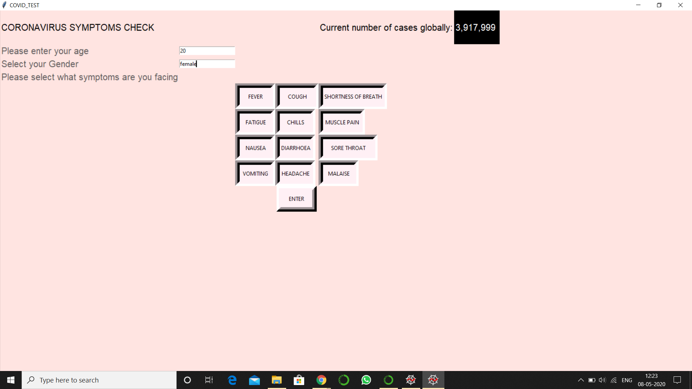
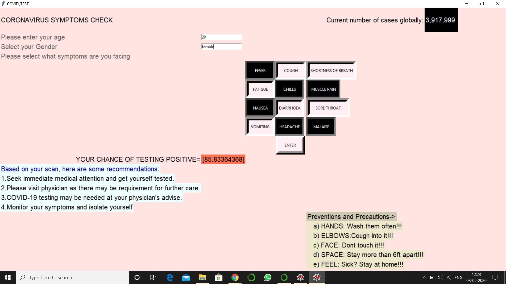

# COVID-19-Symptoms-check
ML project which checks for the symptoms of pandemic COVID-19.

This project is a **machine learning** project which uses python libraries for encrypting the particular purpose. This project allows the user to input their gender and age. In addition to it the users are made to select the various symptoms regarding this deadly pandemic COVID-19. Based on the selected symptoms,age and gender inserted by the user the code predicts the probability of the user's testing positive of this virus. **LOGISTIC REGRESSION** algorithm is used for the precise results.
This project also includes the current statistics of positive patients of COVID-19 pandemic provided by the survey of *World Health Organization ( WHO )*.

As researches have shown that an individual can have positive results of corona virus even if no symptoms are detected but this application only detects when symptoms are inputted.

These are snaps of the GUI (Graphical User Interface) of this project.

SOURCES:  

https://www.kaggle.com/sudalairajkumar/novel-corona-virus-2019-dataset  
https://www.who.int/emergencies/diseases/novel-coronavirus-2019  
  
  
TEAM:  

1.https://github.com/kirtikajain  
2.https://github.com/arpit4120  
3.https://github.com/Nimish-Jain  
4.https://github.com/architgpt2802  
